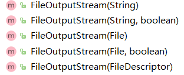

# 第一章    对象入门

面向对象程序设计方法：

1. 一切皆对象；
2. 程序是一大堆对象的组合；
3. 每个对象可封装现有对象制作出新的对象；
4. 每个对象都是某个类的实例；
5. 同一类所有对象都能接受相同信息（可替换性）。

# 第二章　一切皆对象

## ２.８　作用域Scope

变量仅在作用域内存活；new出来的对象在作用域外依然存活，且句柄失效无法使用，垃圾收集器来负责回收。


成员位置的变量即使不初始化，也可以保证默认值：

| 主类型  |     默认值     | 大小 | 最小值     | 最大值          | 封装其类型 |
| :-----: | :------------: | ---- | ---------- | --------------- | ---------- |
| boolean |     false      | 1位  | -          | -               | Boolean    |
|  char   | '\u0000'(null) | 16位 | Unicode  0 | Unicode  2^16-1 | Character  |
|  byte   |    (byte)0     | 8位  | -128       | +127            | Byte       |
|  short  |    (short)0    | 16位 | -2^15      | +2^15-1         | Short      |
|   int   |       0        | 32位 | -2^31      | +2^31-1         | Integer    |
|  long   |       0L       | 64   | -2^63      | +2^63-1         | Long       |
|  float  |      0.0f      | 32位 | IEEE754    | IEEE754         | Float      |
| double  |      0.0d      | 64位 | IEEE754    | IEEE754         | Double     |
|  void   |       -        | -    | -          | -               | void       |

而方法中的变量必须要初始化，否则使用时会编译报错（Java严谨性）。

小转大自动，大专小要造型(Cast)。


# 第六章　类再生

## 6.8 final关键字

final关键字可以用来修饰数据、方法还有类，起着不同的作用：

### 修饰数据

​	修饰**基本数据类型**可以在编译期提前执行，且永远不会改变。

​	修饰**对象句柄**可以将对象句柄变成一个常数。（修饰对象句柄必须初始化到一个对象，且不能指向另一个对象，数组也是一个对象哦。）

​	static final修饰的常量不仅是不变的，而且是唯一的，即无论在那个对象中都不会改变

~~~java
static final int i = (int)(Math.random()*20);//不管在那个对象中，i的值都是一样的,是因为初始化发生在载入时而非创建每一个对象时。
~~~

#### 空白final

空白final可以在变量使用前任意时间进行初始化，增加了灵活性的同时，依然保存了“不变”的本质。

~~~java
class Poppet { }
class BlankFinal {
	final int i = 0; // Initialized final
	final int j; // Blank final
	final Poppet p; // Blank final handle
	// Blank finals MUST be initialized
	// in the constructor:
	BlankFinal() {
		j = 1; // Initialize blank final
		p = new Poppet();
	}
	BlankFinal(int x) {
		j = x; // Initialize blank final
		p = new Poppet();
	}
	public static void main(String[] args) {
		BlankFinal bf = new BlankFinal();
	}
} ///:~
~~~


#### final自变量(final形式参数)

作用：在方法内部，不能改变自变量句柄指向的东西，final修饰的自变量在方法中是只读的。

~~~java
private static final String I = null;
    public static void main(String[] args) {
        changeFinalArgs("hello world");
        changeFinalArgs(null);
    }

    private static void changeFinalArgs(final String s){
        //s = "newValue";//Cannot assign a value to final variable 's'
        //s = null;//Cannot assign a value to final variable 's'
        System.out.println(s);
    }
~~~

结果：

> hello world
> null

### 修饰方法

作用：

1. 为方法上锁，防止任何继承类修改方法（不可覆写/改写）；
2. （方法的工作内容少时）可提高代码执行效率，

类内的所有private方法都隐式指定为final。

### 修饰类

作用：

​	该类不希望被修改，该类禁止被继承，类内所有的方法默认为final。

### final修饰注意事项

​	final可以提高程序的执行效率，但是需要慎重使用，因为final修饰了类或方法，那么以为着其作用被限制了，且对其他程序员不友好。

​	对类库的用户来说，这显然是不应该如此轻易就能看出的。一个产品的设计变得不一致后，会加大用户的工作量。这也从另一个侧面强调了代码设计与检查时需要很强的责任心。

## 6.9 初始化

​	程序启动过程中会首先初始化static对象和static代码块。

~~~java
package com.mlgg.thinkinjava;

/**
 * 打印的结果？
 * @author zhang.yifei4
 * @version 1.0
 * @ClassName Beetle
 * <p>
 * @Date
 * @since v9.0
 */
public class Beetle extends Insect{
    int k = prt("Beetle.k initialized");
    Beetle() {
        prt("k = " + k);
        prt("j = " + j);
    }
    static int x2 =
            prt("static Beetle.x2 initialized");
    static int prt(String s) {
        System.out.println(s);
        return 63;
    }
    public static void main(String[] args) {
        prt("Beetle constructor");
        Beetle b = new Beetle();
    }

}
class Insect {
    int i = 9;
    int j;
    Insect() {
        prt("i = " + i + ", j = " + j);
        j = 39;
    }
    static int x1 =
            prt("static Insect.x1 initialized");
    static int prt(String s) {
        System.out.println(s);
        return 47;
    }
}
/*
* 我的思路：静态常量->构造方法
* static Insect.x1 initialized   1
* static Beetle.x2 initialized   2
* i = 9, j = 0                   4
* Beetle.k initialized           5
* k = 63                         6
* j = 49                         7
* Beetle constructor             3
*
* 错误原因：程序的入口是main方法，创建对象的时候才执行构造方法，静态资源在程序启动时加载完毕。
*
*
* 执行顺序：
*   1. 装载程序找到最外面的类，有父类优先加载父类
*   2. 在根父类执行静态初始化，下一个执行其子类的静态初始化，以此类推
*   3. 类装载完毕，可以创建对象了，创建对象，首先执行构造方法，构造方法中默许执行super(),即首先加载父类的构造方法，以此类推
*   4. 实际变量按照本来的顺序初始化
* */
~~~

# 第七章   多形性

​	抽象、接口

## 内部类

内部类不仅可以隐藏名字和代码组织方案，还可以对封装对象的**所有元素**访问，即内部类有指向外部类的链接。

**<font color="red">内部类对象默认持有创建它那个封装类的一个对象句柄！！！</font>**

### static内部类 

了解static内部类之前需要熟记前面标红的那句话。正文开始：static内部类并不是说这个内部类是静态的，正确理解是

​	（1）为创建一个static内部类的对象，我们不需要一个外部类对象；

​	（2）不能从static内部类的一个对象访问外部类对象。

如果想要创建内部类的一个对象而不想创建外部类的对象，那么需要将所有的东西都设置成static

~~~java
public class Parcel10 {
    private static class PContents
            extends Contents {
        private int i = 11;
        public int value() { return i; }
    }
    protected static class PDestination
            implements Destination {
        private String label;
        private PDestination(String whereTo) {
            label = whereTo;
        }
        public String readLabel() { return label; }
    }
    public static Destination dest(String s) {
        return new PDestination(s);
    }
    public static Contents cont() {
        return new PContents();
    }
    public static void main(String[] args) {
        Contents c = cont();
        Destination d = dest("Tanzania");
    }
}

abstract class Contents {
    abstract public int value();
}
interface Destination {
    String readLabel();
}

~~~

为什么sun公司要大费周折地推出内部类呢？内部类有什么好处呢？ —> 内部类可以较好地响应时间，“由事件驱动系统”，如图形界面、安卓开发等几乎是完全由事件驱动的。

<!--内部类知识点待补充-->

## 构建器

	> 检查对象是否得到正确的构建。只有基础类的构建器在初始化自己的元素时才知道正确的方法以及拥有的权限，所以，必须令所有的构建器都得到调用，否则整个对象构建可能不正确。

构建器的调用遵照下面的顺序：

​		(1) 调用基础类构建器。这个步骤会不断重复下去，首先得到构建的是分级结构的根部，然后是下一个衍生
类，等等。直到抵达最深一层的衍生类。
​		(2) 按声明顺序调用成员初始化模块。
​		(3) 调用衍生构建器的主体。

## 溯型

​	上溯（向上转型）将会造成实现类的拓展成员变量、成员方法丢失。为了获取具体类型信息，我们引入“下溯”，下溯是从小到大，是不安全的过程。Java语言对所有的溯型操作都会进行安全检查和核实，包括括弧转型，如果检查不符，就抛出类转换异常。

~~~java
public class Shangsu {
    public static void main(String[] args) {
        Father f = new Son();
        System.out.println(f.age);
        f.hello();
        f.say();
        //上溯将会丢弃子类自己的成员
        //下溯找回丢失的成员
        Son f1 = (Son) f;
        System.out.println(f1.s);
        f1.speak();
    }
}

abstract class Father {
    public abstract void say();
    public int age = 23;
    public void hello(){
        System.out.println("hello");
    }
}
class Son extends Father {
    public int s = 22;

    @Override
    public void say() {
        System.out.println("father");
    }
    public void speak(){
        System.out.println("son");
    }
}
~~~

结果：

> 23
> hello
> father
> 22
> son

下溯可以使用`instanceof`先检查，以免抛异常。同时Class类中还提供了o1.isInstance(o2)方法，可以动态调用instanceof运算符。

# 第八章 对象容纳	

​	java内建类型：数组

​            工具库提供：集合类

​		数组代表一个简单的线性序列，访问速度非常快，但是初始化大小固定不可变。如果需要改变数组大小，可以将句柄指向新的数组，但是这样改变大小的灵活性会付出地效的代价。

​		所有Java 集合类都能自动改变自身的大小。

​		Stack集合实现了LIFO（后进先出）的堆栈效果，该集合继承了Vector集合。在Vector集合中提供了void addElement(E obj)方法用来存入集合，Stack集合自己的E push(E obj)方法完全使用了addElement(E obj)方法并扩展了返回值。

## 散列表

​		散列码（hashCode）可以获取对象中的信息，然后将其转换成那个对象“相对唯一”的整数（int），散列码(hashCode())来自Object类，所以所有的对象都有散列码。

散列表验证Math.random()方法的随机性如何：

~~~java
public class Statistics {
    public static void main(String[] args) {
        Hashtable ht = new Hashtable();
        for(int i = 0; i < 10000; i++) {
// Produce a number between 0 and 20:
            Integer r =
                    new Integer((int)(Math.random() * 20));
            if(ht.containsKey(r))
                ((Counter)ht.get(r)).i++;
            else
                ht.put(r, new Counter());
        }
        System.out.println(ht);
    }
}
class Counter {
    int i = 1;
    public String toString() {
        return Integer.toString(i);
    }
}
~~~

结果：

> {19=510, 18=488, 17=488, 16=494, 15=496, 14=507, 13=535, 12=491, 11=483, 10=519, 9=495, 8=484, 7=495, 6=493, 5=533, 4=515, 3=508, 2=501, 1=495, 0=470}

​		集合中只允许存放Object的继承类，不能存放基本数据类型，也是泛型存在的意义之一。

​		要在散列表中将自己的类作为键使用，必须同时覆盖hashCode()和equals()方法。

## 集合


### 集合的选择

#### 	选择ArrayList还是LinkedList？

​			ArrayList是基于数组的结构，特点是查询快、增删慢；

​			LinkedList是基于双向链表的结构，特点是增删快、查询慢；

​			Set集合的特点是不能存储相同的元素；

#### 	选择哪种Map？

​			Map集合性能影响最大的是集合的**大小**，不同的Map在不同的大小、不同的机器上计算时间都是不同的。

​			TreeMap提供了出色的put()和反复时间，但get()性能不佳；

​			HashMap设计宗旨是快速检索操作（优先考虑）；

### 并发修改异常

​		在迭代集合的时候如果修改集合会抛出ConcurrentModificationException （并发修改违例），这一机制被称为fast fail（立即失败）。

# 第九章 违例差错控制

​		违例又称异常，最理想是在编译时期捕获，最好是在试图运行程序之前。但并非所有异常都可以在编译时期捕获（编译时期异常），有些异常只能在运行时期捕获（RuntimeException）。

> 产生一个违例时，会发生几件事情。首先，按照与创建Java 对象一样的方法创建违例对象：在内存“堆”
> 里，使用new来创建。随后，停止当前执行路径（记住不可沿这条路径继续下去），然后从当前的环境中释
> 放出违例对象的句柄。此时，违例控制机制会接管一切，并开始查找一个恰当的地方，用于继续程序的执
> 行。这个恰当的地方便是“违例控制器”，它的职责是从问题中恢复，使程序要么尝试另一条执行路径，要
> 么简单地继续。

异常对象的创建可以是默认的，也可以是带有抛出String类型的有参的。一次``` throws``` 的执行大概如下：

1. 执行new表达式创建一个不在程序执行范围内的对象；
2. 调用违例的构造方法创建对象；
3. 对象从方法中返回；
4. 抛异常会从原方法作用域中退出，但是会先返回一个值在退出。

## 

​		RuntimeException不需要我们主动捕获，它会默认被得到处理，编译器不要求为这些类指定范围。也是设计者为了简化代码的设计思想。

```java
public class NeverCaught {
    static void f() {
        throw new RuntimeException("From f()");
    }
    static void g() {
        f();
    }
    public static void main(String[] args) {
        g();
    }
}
```

执行结果：

```java
Exception in thread "main" java.lang.RuntimeException: From f()
	at com.mlgg.thinkinjava.C9.NeverCaught.f(NeverCaught.java:14)
	at com.mlgg.thinkinjava.C9.NeverCaught.g(NeverCaught.java:17)
	at com.mlgg.thinkinjava.C9.NeverCaught.main(NeverCaught.java:20)
```

​		假若一个RuntimeException 获得到达main()的所有途径，同时不被捕获，那么当程序退出时，会为那个违例调用 printStackTrace()。

## 违例的缺点

​		违例可能造成简单的丢失。违例是我们追踪问题的重要步骤，但是一旦在违例里丢失，就会很难发现任何蛛丝马迹。在finally从句中的特殊处理可能导致违例的丢失，如下例：

~~~java
public class LostMessage {
    void f() throws VeryImportantException {
        throw new VeryImportantException();
    }
    void dispose() throws HoHumException {
        throw new HoHumException();
    }
    public static void main(String[] args) throws Exception {
        LostMessage lm = new LostMessage();
        try {
            lm.f();
        } finally {
            lm.dispose();
        }
    }
}
class VeryImportantException extends Exception {
    public String toString() {
        return "A very important exception!";
    }
}
class HoHumException extends Exception {
    public String toString() {
        return "A trivial exception";
    }
}
~~~

控制台追踪：

> Exception in thread "main" A trivial exception
> 	at com.mlgg.thinkinjava.C9.LostMessage.dispose(LostMessage.java:17)
> 	at com.mlgg.thinkinjava.C9.LostMessage.main(LostMessage.java:24)

可以看到没有追踪到VeryImportantException这个重要的异常！

# 第十章  IO系统

与输入有关的类都从InputStream继承，该类提供read()方法供更复杂的类使用；与输出有关的类都从OutputStream继承，提供write()方法。

## InputStream/OutputStream(同)

| 用来标志起源地包括：                           |
| :--------------------------------------------- |
| 字节数组                                       |
| String对象                                     |
| 文件                                           |
| 管道                                           |
| 系列其他流，以便我们将其统一收集到单独一个流内 |
| 其他起源地，如Internet 连接等                  |


FilterInputStream/FilterOutputStream也属于一种InputStream/OutputStream。这两种过滤器给“破坏器”提供一个基础类。

数据源：可以构造初始化




## 过滤器

​		Java IO中使用了装饰者模式，将相同的信息发送给一个对象，无论他是否已被装饰。（[装饰者模式传送门]( https://blog.csdn.net/weixin_38930706/article/details/102742198 )）装饰器的基础类是IO库中存在的Filter类。

​		装饰器FilterInputStream和FilterOutputStream提供了相应的装饰器接口，用于控制一个特定的InputStream或OutputStream。这两个装饰器只是简单模仿了自己的基础类（InputStream和OutputStream）。

## File类

​		File类的名字具有欺骗性，它既可以代表一个文件，也可以代表路径内一系列文件的名字。

```java
private final static String SANZIJING_PATH = "E:\\mlgg\\src\\main\\resources\\file\\三字经.txt";
private final static String FILE_PATH = "E:\\mlgg\\src\\main\\resources\\file";

 @Test
    public void test3() {
        File file = new File(SANZIJING_PATH);
        System.out.println(file);

        System.out.println();

        File files = new File(FILE_PATH);
        String[] list = files.list();
        for (String name: list) {
            System.out.println(name);
        }
    }
```

> E:\mlgg\src\main\resources\file\三字经.txt
>
> number.txt
> The Old Man and the Old Cat.txt
> 三字经.txt

## JDK中的流（1.0 vs 1.1）

DataIn(Out)putStream: 数据流，可以传输的流格式为基本数据类型；

PipedIn(Out)putStream：管道数据流，用于线程间的通信；

| 1.0旧库的字节流                  | 1.1新库的字符流                                       |
| -------------------------------- | ----------------------------------------------------- |
| In(Out)putStream                 | Reader(Writer)      converter: In(Out)putStreamReader​ |
| FileIn(Out)putStream             | FilerReader(Writer)                                   |
| StringBufferInput(没有Out)Stream | StringReader(Writer)                                  |
| ByteArrayIn(Out)putStream        | CharArrayReader(Writer)                               |
| PipedIn(Out)putStream            | PipedReader(Writer)                                   |

Java1.1沿用了Filter装饰这一思想，但是没有采用所有装饰类都从相同Filter基础类中衍生的做法，Java过滤器对部分类没有改变的必要，主要的转变：

| 1.0                      | 1.1                                                          |
| ------------------------ | ------------------------------------------------------------ |
| FilterIn(Out)putStream   | FilterReader(Writer)                                         |
| BufferedIn(Out)putStream | BufferedReader(Writer)                                       |
| DataInputStream          | DataInputStream(除非要使用 readLine()，那时需要使用一个 BufferedReader) |
| PrintStream              | PrintWriter                                                  |
| LineNumberInputStream    | LineNumberReader                                             |
| StreamTokenizer          | StreamTokenizer(用构建器取代Reader)                          |
| PushBackInputStream      | PushBackReader                                               |

### 重定向标准IO

​		在System类中加入加入特殊方法，允许我们标准输入、输出及错误流，用到下面的静态方法调用：

~~~java
setIn(InputStream)
setOut(PrintStream)
setErr(PrintStream)
~~~

-----

```java
public class Redirecting {
    public static void main(String[] args) {
        String redirectingPath = "E:\\mlgg\\src\\main\\java\\com\\mlgg\\thinkinjava\\C10\\Redirecting.java";
        String redirectingOutPath = "E:\\mlgg\\src\\main\\java\\com\\mlgg\\thinkinjava\\C10\\test.out";
        try {
            BufferedInputStream in = new BufferedInputStream(new FileInputStream(redirectingPath));
            // Produces deprecation message:
            PrintStream out = new PrintStream(new BufferedOutputStream(new FileOutputStream(redirectingOutPath)));
            System.setIn(in);
            System.setOut(out);
            System.setErr(out);
            BufferedReader br = new BufferedReader(new InputStreamReader(System.in));
            String s;
            while ((s = br.readLine()) != null)
                System.out.println(s);
            out.close();
        } catch (IOException e) {
            e.printStackTrace();
        }
    }
}
```

这个程序的作用是将标准输入同一个文件连接起来，并将标准输出和错误重定向至另一个文件。

## Java1.1 压缩

| 压缩类               | 功能                                                     |
| -------------------- | -------------------------------------------------------- |
| CheckedInputStream   | GetCheckSum()为任何InputStream 产生校验和（不仅是解压）  |
| CheckedOutputStream  | GetCheckSum()为任何OutputStream 产生校验和（不仅是解压） |
| DeflaterOutputStream | 用于压缩类的基础类                                       |
| ZipOutputStream      | 一个DeflaterOutputStream，将数据压缩成Zip文件格式        |
| GZIPOutputStream     | 一个DeflaterOutputStream，将数据压缩成GZIP 文件格式      |
| InflaterInputStream  | 用于解压类的基础类                                       |
| ZipInputStream       | 一个 DeflaterInputStream，解压用 Zip文件格式保存的数据   |
| GZIPInputStream      | 一个DeflaterInputStream，解压用GZIP 文件格式保存的数据   |

ZIP和GZIP是最常用两种压缩方式的两种。

还有一种JAR（Java Rchive）归档压缩方式，像zip一样将一系列文件合并到单个压缩文件里，JAR文件是跨平台的。在涉及英特网应用时，JAR文件显得非常有用。另外，JAR文件里的每一个入口都可以加上数字化签名。

一个JAR文件由一系列采用 Zip压缩格式的文件构成，同时还有一张“详情单”，对所有这些文件进行了描述。

jar实用程序已与Sun 的JDK配套提供，可以按我们的选择自动压缩文件。请在命令行调用它：

>jar [选项] 说明 [详情单] 输入文件
>其中，“选项”用一系列字母表示（不必输入连字号或其他任何指示符）。如下所示：
>c 创建新的或空的压缩档
>t 列出目录表
> 315
>x 解压所有文件
>x file 解压指定文件
>f 指出“我准备向你提供文件名”。若省略此参数，jar 会假定它的输入来自标准输入；或者在它创建文件
>时，输出会进入标准输出内
>m 指出第一个参数将是用户自建的详情表文件的名字
>v 产生详细输出，对 jar做的工作进行巨细无遗的描述
>O 只保存文件；不压缩文件（用于创建一个 JAR文件，以便我们将其置入自己的类路径中）
>M 不自动生成详情表文件
>在准备进入 JAR文件的文件中，若包括了一个子目录，那个子目录会自动添加，其中包括它自己的所有子目
>录，以此类推。路径信息也会得到保留。
>下面是调用 jar的一些典型方法：
>jar cf myJarFile.jar *.class
>用于创建一个名为myJarFile.jar 的 JAR文件，其中包含了当前目录中的所有类文件，同时还有自动产生的
>详情表文件。
>jar cmf myJarFile.jar myManifestFile.mf *.class
>与前例类似，但添加了一个名为myManifestFile.mf的用户自建详情表文件。
>jar tf myJarFile.jar
>生成myJarFile.jar 内所有文件的一个目录表。
>jar tvf myJarFile.jar
>添加“verbose”（详尽）标志，提供与myJarFile.jar 中的文件有关的、更详细的资料。
>jar cvf myApp.jar audio classes image
>假定audio，classes 和image 是子目录，这样便将所有子目录合并到文件myApp.jar 中。其中也包括了
>“verbose”标志，可在jar 程序工作时反馈更详尽的信息。
>如果用O 选项创建了一个JAR文件，那个文件就可置入自己的类路径（CLASSPATH）中：
>CLASSPATH="lib1.jar;lib2.jar;"
>Java 能在lib1.jar 和 lib2.jar 中搜索目标类文件。

## 对象序列化

​		对象序列化面向那些实现了`Serializable`接口的对象，可将他们转换成一系列字节，并可在以后完全恢复回原来的样子，这一过程亦可通过网络进行，意味着去操作系统的差异性。

​		java中`static`和`transient`修饰的属性不被序列化。序列化敏感信息会又泄漏的风险，java提供了`Externalizable`接口可以拒绝自动序列化，明确序列化那些需要的部分需要使用writeExternal()方法。简单的方法是，直接给铭感信息属性（如密码）使用`transient`修饰。

# 第十二章  传递和返回对象

## 克隆

​		Object类提供Object clone()方法用来进行对象的克隆，克隆后需要进行下溯。clone()方法的克隆是**浅克隆**，这种克隆并没有包括句柄指向的所有对象以及那些对象又指向的其他对象，以此类推。**深克隆**需要做的是复制这个对象包含的整个<font color="red">对象网</font>。

> **浅克隆**：创建一个新对象，新对象的属性和原来对象完全相同，对于非基本类型属性，仍指向原有属性所指向的对象的内存地址。
>
> **深克隆**：创建一个新对象，属性中引用的其他对象也会被克隆，不再指向原有对象地址。

​		简单的说，Object类提供的clone()的直接使用，仅仅是对简单对象（不包含其他对象）的类进行克隆。

## 使类具有克隆能力

​		Object类中的clone()方法使用<font color="blue">protected</font>关键字修饰，所以继承者默认是不具有克隆功能的。使类能克隆我们首先需要类实现Cloneable接口，并且覆写Clone类为<font color="blue">public</font>,子类覆写方法中返回`super.clone()`。

### 为什么要实现Cloneable?

​		Cloneable接口是空的，那么为什么还要实现这个“欺骗性”的接口呢？  其实该接口实际扮演的是一个标记角色，存在的原因：

> 可能有一个上溯造型句柄指向一个基础类型，而且不知道它是否真的能克隆那个对象。
>
> 我们可能不愿所有对象类型都能克隆

如果不实现该接口，对类进行克隆，会抛出`CloneNotSupportedException`异常。真正起克隆效果的是覆写的pulic Object clone()方法。

那么，为什么实现克隆需要两步这似乎有些繁琐，其实，是出于在网络上的安全考虑，必须完全符合规格，才可进行复制。也可以理解成java对克隆网络安全补丁。

### 深克隆和浅克隆的演示

测试类：

~~~java
public class CloneTest {


    public static void main(String[] args) throws CloneNotSupportedException {
        PhoneA phoneA = new PhoneA();
        PhoneB phoneB = new PhoneB();
        phoneB.setName("huawei");
        phoneB.setPrice(3999);
        phoneB.setBattery(new Battery("byd",4000));
        PhoneA cloneA = (PhoneA) phoneA.clone();
        PhoneB cloneB = (PhoneB) phoneB.clone();

        System.out.println("浅克隆：克隆的电池等于原电池？"+ (phoneA.getBattery() == cloneA.getBattery()));//true浅克隆的电池句柄指向同一个对象
        System.out.println("深克隆：克隆的电池等于原电池？"+ (phoneB.getBattery() == cloneB.getBattery()));//false深克隆的电池是新创建的对象
    }
}
~~~

Battery对象是两个Phone类的合成类，也要实现Cloneable接口：

~~~java
public class Battery implements Cloneable{

    public Battery(String brand, int capacity) {
        this.brand = brand;
        this.capacity = capacity;
    }

    public Battery() {
    }

    private String brand;

    private int capacity;

    @Override
    public Object clone() throws CloneNotSupportedException {
        return super.clone();
    }
}
~~~

支持浅克隆的PhoneA类，仅仅克隆一般成员和<font color="green">合成类成员的句柄</font>：

~~~java
public class PhoneA implements Cloneable {

    private String name;
    private int price;
    private Battery battery;

    public String getName() {
        return name;
    }

    public void setName(String name) {
        this.name = name;
    }

    public int getPrice() {
        return price;
    }

    public void setPrice(int price) {
        this.price = price;
    }

    public Battery getBattery() {
        return battery;
    }

    public void setBattery(Battery battery) {
        this.battery = battery;
    }

    @Override//浅克隆
    public Object clone() throws CloneNotSupportedException {
        return super.clone();
    }
}
~~~

支持深克隆的PhoneB不仅克隆了一般成员，而且在克隆方法里克隆了包含的电池对象：

~~~java
package com.mlgg.thinkinjava.C12.protectedKW.entity;

/**
 * <Description> <br>
 *
 * @author zhang.yifei4<br>
 * @Date 10:53 2019/11/5
 * @see com.mlgg.thinkinjava.C12.protectedKW.entity
 */
public class PhoneB implements Cloneable {
    private String name;
    private int price;
    private Battery battery;

    public String getName() {
        return name;
    }

    public void setName(String name) {
        this.name = name;
    }

    public int getPrice() {
        return price;
    }

    public void setPrice(int price) {
        this.price = price;
    }

    public Battery getBattery() {
        return battery;
    }

    public void setBattery(Battery battery) {
        this.battery = battery;
    }

    @Override
    public Object clone() throws CloneNotSupportedException {
        PhoneB b = (PhoneB) super.clone();
        b.battery = (Battery) b.battery.clone();
        return b;
    }
}

~~~

主要代码在于`b.battery = (Battery) b.battery.clone();`。

所以输出的结果也是不相同的：

​		<font color="gray">浅克隆：克隆的电池等于原电池？true
</font>

​		<font color="grey">深克隆：克隆的电池等于原电池？false</font>

### 为什么不用序列化克隆？

​		序列化->反序列化的执行效率远低于克隆，并且序列化运行结果不稳定，而克隆每次花费的时间是相同的。

### 使类具有更大的克隆深度

​		我们知道，新建的类是不默认有克隆能力的。我们在设计中一旦赋予哪个类克隆能力，那么它的所有后裔就都具有克隆能力了。